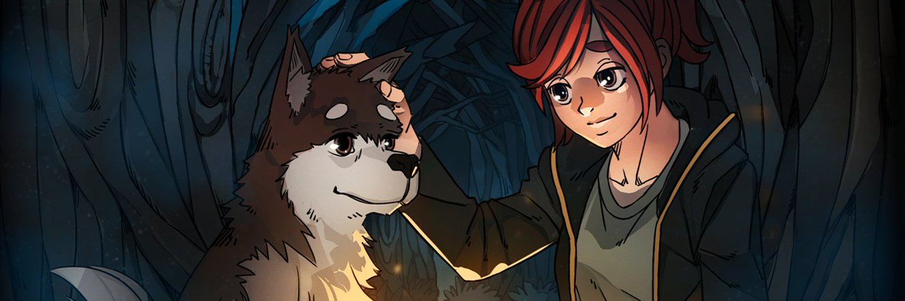
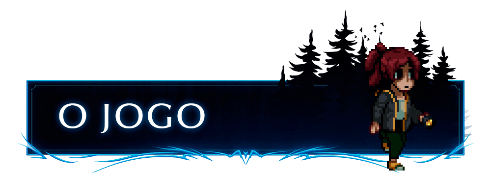

      

<h1 align="center">
    <strong>Ordem Paranormal: Enigma do Medo</strong>
</h1>

<<<<<<< HEAD
      
=======
      
>>>>>>> 00a2629acda422934e28401cdd26216b35aaecc5

## 💻 Sobre

**[Enigma do Medo](https://www.catarse.me/ordem)** é um jogo de exploração, enigmas e sobrevivência do universo do RPG criado por **Rafael Lange (Cellbit)**.

Veja mais e apoie o jogo em: [Ordem Paranormal: Enigma do Medo - Catarse](https://www.catarse.me/ordem)

## 🚀 Tecnologias

Site sobre o Enigma do Medo foi desenvolvido utilizando as seguintes tecnologias:

- HTML
- CSS
